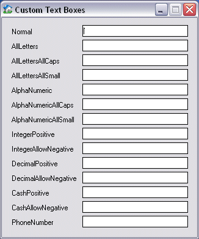



## Text Box Tweaker\!

### Description

Supports 14 Different Modes!! All with the extended ability to ban or allow a certain set of characters! Control number of Decimal Places for Decimal values. Allow|DisAllow Negative values. Control Character Case and more! All in one little module :) Please Take time to Vote and Comment. Enjoy ;)
 
### More Info
 

             |
---                |---
**Submitted On**   |2002-09-22 12:25:04
**By**             |[Waleed A\. Aly](https://github.com/Planet-Source-Code/PSCIndex/blob/master/ByAuthor/waleed-a-aly.md)
**Level**          |Intermediate
**User Rating**    |5.0 (15 globes from 3 users)
**Compatibility**  |VB 6\.0
**Category**       |[Coding Standards](https://github.com/Planet-Source-Code/PSCIndex/blob/master/ByCategory/coding-standards__1-43.md)
**World**          |[Visual Basic](https://github.com/Planet-Source-Code/PSCIndex/blob/master/ByWorld/visual-basic.md)
**Archive File**   |[Text\_Box\_T1344899222002\.zip](https://github.com/Planet-Source-Code/waleed-a-aly-text-box-tweaker__1-39181/archive/master.zip)

